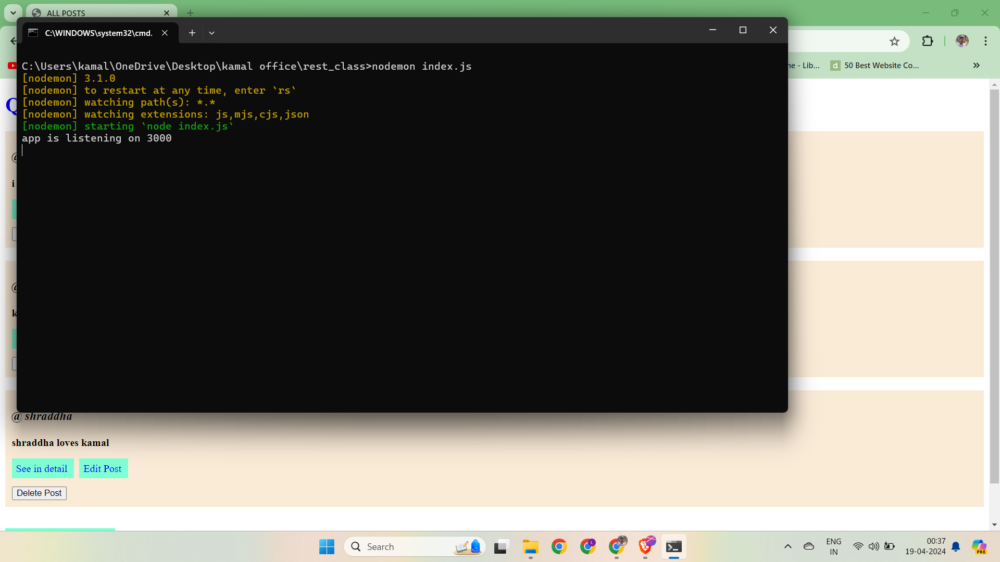
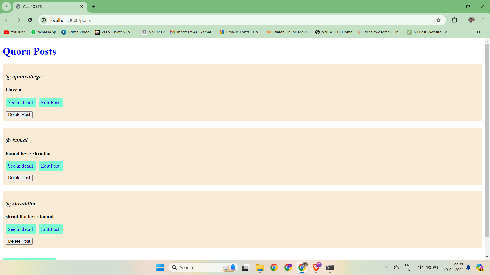
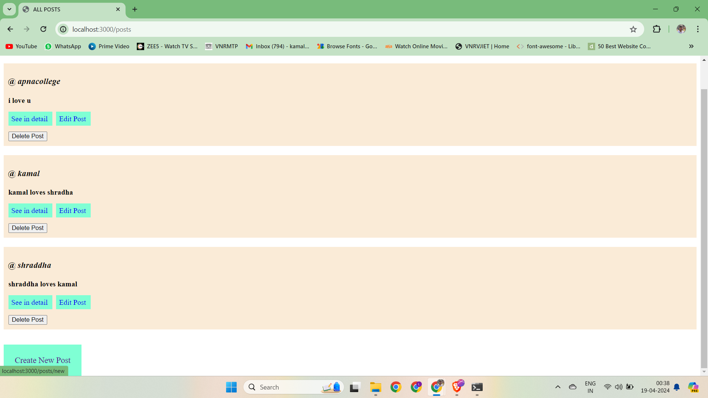

# Simple Express Blog Application

This is a simple blog application built using Node.js and Express. It allows users to view existing posts, create new posts, edit existing posts, and delete posts.

## Prerequisites

Before running this application, ensure you have the following installed on your machine:

- Node.js
- npm (Node Package Manager)

## Installation

1. Clone the repository to your local machine:

    ```bash
    git clone <repository-url>
    ```

2. Navigate to the project directory:

    ```bash
    cd <project-directory>
    ```

3. Install dependencies:

    ```bash
    npm install
    ```

## Usage

To start the application, run the following command:

```bash
node app.js
```

The application will start running on port 3000 by default. You can access it by navigating to `http://localhost:3000` in your web browser.

## Features

- **View Posts**: Navigate to `/posts` to view existing posts.
- **Create New Post**: Navigate to `/posts/new` to create a new post.
- **Edit Post**: Click on a post's title to navigate to its edit page (`/posts/:id/edit`).
- **Delete Post**: Click on the delete button next to a post to delete it.

## Dependencies

### Express

[Express](https://www.npmjs.com/package/express) is a fast, unopinionated, minimalist web framework for Node.js. It provides a robust set of features for web and mobile applications.

### EJS

[EJS](https://www.npmjs.com/package/ejs) is Embedded JavaScript templates for Node.js. It allows you to generate HTML markup with plain JavaScript.

### UUID

[UUID](https://www.npmjs.com/package/uuid) is used to generate RFC-compliant UUIDs (Universally Unique Identifiers) in JavaScript. These UUIDs are used as unique identifiers for each post in the blog.

### Method-Override

[Method-Override](https://www.npmjs.com/package/method-override) is middleware for Express to override HTTP methods. It allows you to use HTTP verbs such as PUT or DELETE in places where the client doesn't support it.

## Contributing

Contributions are welcome! Please feel free to submit a pull request or open an issue for any bugs or feature requests.

## Demonstration

###Initializing on local host at port number 3000 using cmd






